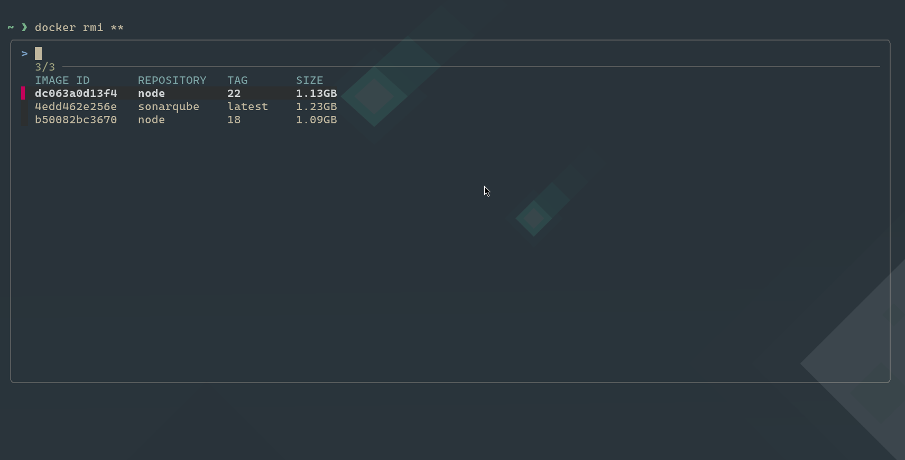

# Docker + FZF Autocomplete

This script makes Docker commands easier to use with [fzf](https://github.com/junegunn/fzf).

It lets you pick containers, images, and commands with a fuzzy search menu in your terminal.



<b>It simply shows what you need, no more having to remember docker autogenerated container names!!</b>


## What is it for

- Lets you fuzzy search Docker commands
- Shows only running containers when you use docker stop
- Shows only exited containers when you use docker start or docker rm
- Shows all images when you use docker rmi
- Works with logs, exec, cp, and more
- Falls back to normal if fzf or docker is missing

## How to use

Type a docker command type `**` and then press <kbd>TAB</kbd> to pick from a list.

### Examples

```bash
docker stop **<TAB>    # pick from running containers
docker start **<TAB>   # pick from exited containers
docker rm **<TAB>      # pick from exited containers
docker rmi **<TAB>     # pick from images
docker logs **<TAB>    # pick from all containers
docker exec **<TAB>    # pick from running containers
docker cp **<TAB>      # pick from all containers
docker **<TAB>         # pick from all docker commands
```

## Requirements

- [Docker](https://www.docker.com/)
- [fzf](https://github.com/junegunn/fzf)

## Installation

1. Clone this repo:
```bash
git clone https://github.com/PabloSanchi/docker-fzf-autocomplete.git
cd docker-fzf-autocomplete
```

2. Run the install script:
```bash
./install.sh
```

3. Reload shell rc
```bash
source ~/.bashrc
```

## Manual Installation

1. Create a folder `fzf` under `.config`
    ```bash
    mkdir -p "$HOME/.config/fzf"
    ```
2. Copy the file `docker.config` into your newly created directory

3. Append the following to you shell rc
    ```bash
    source ~/.config/fzf/docker.config
    ```
4. Reload
    ```bash
    source ~/.bashrc
    ```

## Additional step

In order to have same style as shown in the image it's important to configure `FZF_DEFAULT_OPTS` as follows:

```bash
FZF_DEFAULT_OPTS="--border --reverse --height 40%"
```
